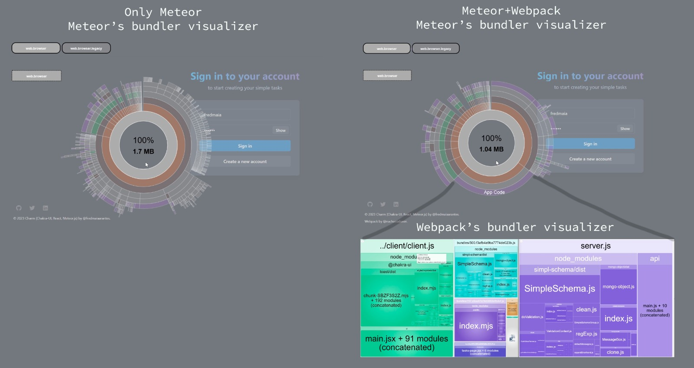
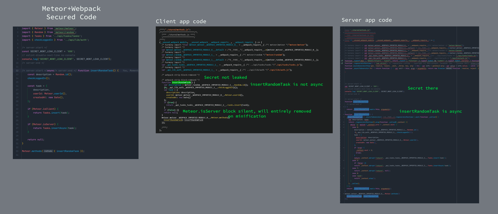
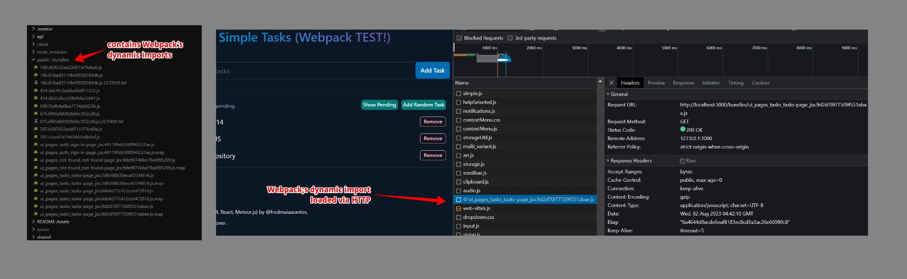

# Simple Tasks (with Webpack)

Describes a configuration to use Webpack with Meteor (or actually any bundler you like).

Built using as a small example described in this repository: [fredmaiaarantes/simpletasks](https://github.com/fredmaiaarantes/simpletasks).

Demo: https://simpletaskswebpack.meteorapp.com

Original: https://simpletasks.meteorapp.com


https://github.com/freak2geek/simpletasks-webpack/assets/2581993/dbb4a3d6-39b8-4cb9-a73b-c0608f9014b3


## Motivation

Over the years, Meteor has been instrumental in supporting numerous companies and individuals in building their products, providing a tool that facilitates the process of product development and delivery. However, as technology advances and becomes more sophisticated, it is a must for us to embrace new tools that can enhance security, performance, and development speed to adapt ourselves with the growing demands of our products.

One area where Meteor has yet to evolve significantly is its bundler. Introducing features like Tree Shaking would be highly advantageous for any expanding project. Although [Meteor has made attempts to include it in the core](https://github.com/meteor/meteor/pull/11164), proper implementation has not arrived yet. In contrast, other bundlers like Webpack have already integrated such features effectively, pushing other platforms to evolve rapidly while Meteor stays behind. Moreover, other bundlers have adopted a range of plugins that empower developers to deliver solutions more efficiently, providing clear benefits for those familiar with these tools.

This repository aims to enrich Meteor projects with a straightforward yet powerful solution, enabling developers to incorporate the latest bundler trends and capabilities into their projects as needed.

The decision to choose Webpack is based on its robustness, wide usage, and continuous maintenance, along with the abundance of extensions and features it offers. However, it is important to note that the same solution can be adapted to other popular bundlers with some configuration adjustments. I provide you here an example of Webpack configuration in this repository for your reference.

## How

The solution is straightforward: mix the power of both Meteor and Webpack to construct your app.

- Let Webpack to compile just your app code, taking advantage of all the bundler benefits it offers.
- Let Meteor insert its modules into the app code.

This approach allows you to enjoy the best of both worlds.

With Webpack, your app bundle becomes lean, yet robust and secure, ready to go live with confidence. By incorporating Meteor, you unlock a high amount of powerful features, including reactivity, a simple API, data isomorphism, a collection of well-crafted packages for rapid development, an so on.

- The `webpack.config.js` file contains essential configurations for both client and server environments, covering development and production settings.
- The `ui/main.jsx` and `api/main.js` files are designated as entry points for the app code and are properly configured in Webpack to facilitate the app's compilation.
- Two app artifacts are generated after Webpack compilation: `client/client.js` and `server/server.js`. These files become the new entry points for the Meteor app (`meteor/mainModule` in `package.json`), allowing it to recognize and utilize the Meteor packages properly.

The expected outcome is achieved: the app code is compiled by Webpack, and then Meteor recompile the Webpack application, making it fully compatible with the Meteor core and packages.

The `.meteorignore` file is configured for Meteor to exclude the app code located within the `ui/` and `api/` directories for the watching files development processes. Webpack exclusively handles the compilation and management of these folders now.

## Hands-on

The scripts are described in the `package.json` and those enforce the proper development experience and production deploy.

### Install dependencies

```bash
meteor npm install
```

### Running the app

```bash
meteor npm start
```

### Visualize the app bundles

```bash
meteor npm run visualize
```

On `http://localhost:3000` you still have the information gathered by Meteor bundle-visualizer package.

With `http://localhost:8888` (client) and `http://localhost:8889` (server) you have the bundle information of the app code bundled by Webpack thanks to the [`webpack-bundle-analyzer`](https://github.com/webpack-contrib/webpack-bundle-analyzer).

### Cleaning up you local db

```bash
meteor reset
```

### Cleaning up cache

To clean the Meteor's and Webpack's cache, including node_modules.

```bash
meteor npm run clean
```

Useful to avoid compilation errors caused by the state of caches. Don't forget to `meteor npm install` again.

### Deploy to Galaxy with free MongoDB

```bash
meteor npm run deploy -- --free --mongo
```

## What is supported so far?

### Tree Shaking

Webpack configures [Tree Shaking](https://webpack.js.org/guides/tree-shaking/) effictively when going to production mode.

The best way to check about it is to run the bundler visualizer. In this app example, the bundled has been reduced from ~1.7MB to 1MB. Just imagine in large apps.



### Secured Code

Thanks to the [Webpack's DefinePlugin](https://webpack.js.org/plugins/define-plugin/) the configuration describes a variable replacement for `Meteor.isXXX`-like variables. Therefore, any specific environment code will be effectively wiped out from the final bundle. Like `Meteor.isServer` and `Meteor.isClient` removing properly behaviors and sensitive information in shared env code. Also enabled for `Meteor.isDevelopment` and `Meteor.isProduction`.

And if that is not enough, thanks to a Webpack plugin named [`webpack-strip-block`](https://www.npmjs.com/package/webpack-strip-block), comment delimiters exist to remove parts of the code the same way. Like `/* server:start */ CODE /* server:end */` that will remove properly the server code from the client code. There is [an intersting use case](https://github.com/freak2geek/simpletasks-webpack/blob/main/shared/methods.js) on exposing a client method sync and the server as async which can be useful for Fiber migration.

These two are also limitations on Meteor bundler.



### Dynamic imports

[Dynamic imports](https://webpack.js.org/guides/code-splitting/) can still be utilized in this approach, but they function similarly to Webpack's implementation. In the basic configuration, Webpack is set up to perform code splitting and generate chunks stored in the `/public/bundles` folder, which will load as expected using Webpack's approach.

The following illustration depicts how dynamic imports are resolved in this project by Webpack. These dynamic imports are made accessible in the `/public/bundles` folder and are automatically served via standardized HTTP, enabling efficient caching of these modules, among other valuable benefits. Besides, these bundles will be stored as files on the native app compilation, a current limitations on dynamic imports in Meteor.



### Cache

Cache for Webpack is also enabled to speed up cold and incremental building. Besides, development mode won't include any node modules included on the app code, those will be provided by Meteor cache mechanisms which are better in this sense. This speeds up the development experience, Webpack will get few ms to recompile just the app code, not thrid part dependencies, and then Meteor reacts for rebuilding fast with all other modules already cached. In production mode, everything app and third-part packages gets compiled by Webpack.

### Advanced Bundle Visualizer

Meteor's bundle visualizer provides an overview of the Meteor core, introduced packages, and the entire app code compiled by Webpack.

However, with the inclusion of [Webpack's Bundle Visualizer](https://github.com/webpack-contrib/webpack-bundle-analyzer), you gain the advantage of examining the client and server code independently. This enables you to effectively verify which modules have been included or excluded in the final bundle with advanced searching capabilities. Additionally, the visualizer allows you to inspect each dynamic import chunk and its respective contents at any given time, providing deeper insights into your application's bundle composition and performance.

https://github.com/freak2geek/simpletasks-webpack/assets/2581993/7525a0dd-2938-4b7d-b191-100f7f70b3cd


## Downsides

While this approach offers numerous advantages, it does come with its own set of disadvantages. To be able to adapt existing apps using this approach you must ensure to handle these:

### No Nested Imports

The absence of nested imports, a specific feature native to Meteor bundler that allows for deferred logic loading. Nested imports have proven to have a positive impact on app performance. As technology evolves, other compilers might not yet recognize nested imports, just as the case with features like Fibers, which were adopted but haven't become a standard and are now being phased out.

### No Dynamic Imports (DDP)

Meteor's dynamic imports rely on the DDP protocol to serve the chunks, and this can present challenges. In the context of this approach, Meteor's dynamic imports won't work optimally, despite attempts to address the issue. From my perspective, relying on a more standardized approach appears to be a preferable choice.

## Improvements

This provides a straightforward approach for structuring a project that gets the power of two compilers. As mentioned earlier, this approach can be adapted for any other bundler, such as Vite or other popular choices.

There are additional configurations that in Webpack can be done which depends on the specific nature of the project. In my own projects, I successfully implemented the following configurations:

- [Workbox Webpack plugin](https://developer.chrome.com/docs/workbox/modules/workbox-webpack-plugin/) for Service Worker implementation for PWA
- [Assets management via Webpack Loaders](https://webpack.js.org/guides/asset-management/) (images, fonts, json, pdf, and so on.)
- Meteor testing system using Webpack compilations
- [SWC](https://swc.rs/) for code transpiler
- [JS Obfuscator Webpack](https://github.com/javascript-obfuscator/webpack-obfuscator)
- [Image Minimizer Webpack plugin](https://github.com/webpack-contrib/image-minimizer-webpack-plugin)
- Typescript Support with check on compile time
- Eslint Support with check on compile time
- Style (SCSS) compilation
- [and much more](https://github.com/orgs/webpack-contrib/repositories?type=source)
